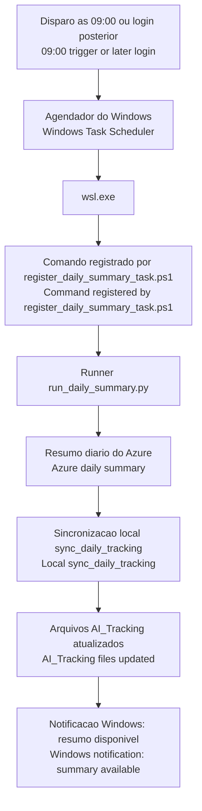

# KwikLedgers Dev Agent

Repository name: `kwikledgers-agent`

Folder: `/home/ambra/Kwikledgers/agent`

Description: Azure DevOps-focused Copilot agent repository for daily sprint follow-up, local AI tracking, MCP integration, and implementation guidance across KwikLedgers projects.

Agente de desenvolvimento integrado ao VS Code que:
- Acessa o Azure DevOps para listar historias, tasks, bugs e PRs do usuario ativo
- Gera arquivos locais de controle do sprint, log diario e metricas de IA
- Destaca bloqueios, itens devolvidos por mudanca de estado e story points restantes
- Analisa a estrutura do projeto para manter consistencia tecnica quando os repositorios estiverem em `projects/`
- Envia notificacoes e gerencia lembretes no Windows (inclusive via WSL)

## English

### First Steps

1. Run `setup.sh` on Linux or WSL, or `setup.ps1` on Windows.
2. Fill the `.env` file with Azure DevOps credentials and project settings.
3. Let the setup synchronize `.vscode/mcp.json` and `.github/agents/kwikledgers-dev.agent.md` into each initialized repository under `../projects/`.
4. Open the workspace in VS Code and allow the MCP servers.
5. Select `KwikLedgers Dev Agent` in Copilot Chat.
6. Start with a daily summary and a local tracking sync.

Standalone re-sync commands:

- Linux/WSL: `bash resync-project-agents.sh`
- Windows PowerShell: `./resync-project-agents.ps1`

### How To Use

Use this repository when you need the agent runtime itself, not product
application code.

Typical prompts:

- `Show my daily Azure summary.`
- `Update my local sprint tracking files.`
- `Refresh only the current sprint task-control snapshot.`
- `Do I have blocked or returned items?`
- `Show my tracking snapshot status.`
- `List my next Outlook deadlines for the next 7 days.`
- `Register today's AI usage metrics.`

### Repository Guides

- [CONTRIBUTING.md](CONTRIBUTING.md)
- [SECURITY.md](SECURITY.md)
- [Bug report template](.github/ISSUE_TEMPLATE/bug_report.md)
- [Feature request template](.github/ISSUE_TEMPLATE/feature_request.md)
- [Documentation update template](.github/ISSUE_TEMPLATE/documentation_update.md)

## Recommended License Structure

For internal company use, the recommended structure is:

```text
LICENSE.md
README.md
CONTRIBUTING.md
```

Suggested license label:

- `Proprietary - Internal Use Only`

## Estrutura

```
agent/
  kwikledgers.agent.md           <- Definicao e regras do agente
  .vscode/
    mcp.json                     <- Configuracao dos MCP Servers
  mcp_servers/
    azure_devops/
      server.py                  <- MCP Server: Azure DevOps
      requirements.txt
    local_tracking/
      server.py                  <- MCP Server: gera AI_Tracking/
      requirements.txt
    windows_calendar/
      server.py                  <- MCP Server: Windows Calendar + Notificacoes
      requirements.txt
  .env.example                   <- Template de variaveis de ambiente
  setup.sh                       <- Script de instalacao para Linux/WSL
  setup.ps1                      <- Script de instalacao para Windows (PowerShell)
  README.md
```

## Instalacao

### Pre-requisitos
- Python 3.12+
- Node.js 18+
- VS Code com GitHub Copilot
- Outlook instalado no Windows (para calendario e notificacoes)

---

### Instalacao no WSL (recomendado para a equipe KwikLedgers)

#### Passo 1: Clonar o repositorio dentro do WSL
```bash
cd ~
git clone https://viwaredevops@dev.azure.com/viwaredevops/Kwik%20Ledgers/_git/kwikledgers-dev-agent agent
cd agent
```

#### Passo 2: Rodar o setup
```bash
chmod +x setup.sh
./setup.sh
```

#### Passo 3: Preencher as credenciais
O setup.sh cria o arquivo `.env` automaticamente. Edite-o:
```bash
nano .env
```
Preencha os valores:
```
AZURE_ORG_URL=https://dev.azure.com/viwaredevops
AZURE_PAT=seu_personal_access_token
AZURE_USER_EMAIL=seu_email@empresa.com
AZURE_PROJECT=Kwik Ledgers
AZURE_TEAM=Squad Portal Market Place
KWIKLEDGERS_WINDOWS_NOTIFICATION_TIMEOUT_SECONDS=20
KWIKLEDGERS_WINDOWS_OUTLOOK_TIMEOUT_SECONDS=90
```

Os MCP servers procuram `.env` automaticamente subindo pela arvore de diretorios.
Isso permite separar `azure_devops/`, `local_tracking/` e `windows_calendar/` em submodulos Git sem quebrar a descoberta de configuracao.
Se quiser apontar explicitamente para outro arquivo, defina `KWIKLEDGERS_ENV_FILE` ou `MCP_ENV_FILE`.
O setup tambem prepara o runtime compartilhado em `mcp_servers/.venv` e grava um stamp de requisitos para cada servidor.

Observacao sobre TLS no WSL/Zscaler:
Se o shell exportar `SSL_CERT_FILE`, `REQUESTS_CA_BUNDLE`, `AZURE_CA_BUNDLE` ou `CURL_CA_BUNDLE` apontando para um certificado isolado como `ZscalerRootCA.crt`, o agente agora normaliza esses overrides para o bundle completo do sistema antes de chamar o Azure DevOps. Isso evita falhas de `CERTIFICATE_VERIFY_FAILED` quando o proxy corporativo injeta a cadeia completa no trust store padrao do Linux.

#### Passo 4: Recarregar o shell
```bash
source ~/.bashrc   # ou source ~/.zshrc
```

#### Passo 5: Copiar o mcp.json para o workspace
```bash
mkdir -p /home/seu_usuario/Kwikledgers/.vscode
cp .vscode/mcp.json /home/seu_usuario/Kwikledgers/.vscode/mcp.json
```

#### Passo 6: Reiniciar o VS Code e usar
- Abra o Copilot Chat: Ctrl+Alt+I
- Selecione o agente: KwikLedgers Dev Agent
- Na primeira vez, clique em Allow em cada MCP Server

---

### Instalacao no Windows (PowerShell)

#### Passo 1: Clonar
```powershell
git clone https://viwaredevops@dev.azure.com/viwaredevops/Kwik%20Ledgers/_git/kwikledgers-dev-agent agent
cd agent
```

#### Passo 2: Setup
```powershell
.\setup.ps1
```

#### Passo 3: Variaveis de ambiente
```powershell
setx AZURE_ORG_URL   "https://dev.azure.com/viwaredevops"
setx AZURE_PAT       "seu_personal_access_token"
setx AZURE_USER_EMAIL "seu_email@empresa.com"
setx AZURE_PROJECT   "Kwik Ledgers"
```
Reinicie o terminal apos configurar.

---

## Gerando o Azure Personal Access Token (PAT)

1. Acesse: https://dev.azure.com/viwaredevops/_usersSettings/tokens
2. Clique em "+ New Token"
3. Nome: KwikLedgers Dev Agent
4. Expiracao: 1 ano
5. Permissoes:
   - Work Items: Read & Write
   - Code: Read
   - Pull Request Threads: Read & Write
6. Copie o token gerado para AZURE_PAT

## Primeiros Passos

1. Rode `setup.sh` no Linux ou WSL, ou `setup.ps1` no Windows.
2. Preencha o arquivo `.env` com as credenciais do Azure DevOps e as
  configuracoes do projeto.
3. Deixe o setup sincronizar `.vscode/mcp.json` e `.github/agents/kwikledgers-dev.agent.md` em cada repositorio inicializado em `../projects/`.
4. Abra o workspace no VS Code e autorize os MCP servers.
5. Selecione `KwikLedgers Dev Agent` no Copilot Chat.
6. Comece com o resumo diario e a sincronizacao do tracking local.

Comandos dedicados de re-sync:

- Linux/WSL: `bash resync-project-agents.sh`
- Windows PowerShell: `./resync-project-agents.ps1`

## Agendamento Diario No Windows

Para executar o resumo diario automaticamente as 09:00 a partir do Task Scheduler do Windows, use o runner em `agent/scripts/run_daily_summary.py` com a tarefa pronta em `agent/scripts/register_daily_summary_task.ps1`.

To run the daily summary automatically at 09:00 from Windows Task Scheduler, use the runner in `agent/scripts/run_daily_summary.py` together with the ready-to-register task in `agent/scripts/register_daily_summary_task.ps1`.

Fluxo do agendamento / Scheduling flow:



Exemplo a partir de um PowerShell no Windows, quando o workspace estiver no WSL:

```powershell
& "\\wsl$\Ubuntu\home\ambra\Kwikledgers\agent\scripts\register_daily_summary_task.ps1" `
  -WorkspaceRoot "/home/ambra/Kwikledgers" `
  -WslDistro "Ubuntu" `
  -Time "09:00"
```

O agendamento chama `wsl.exe`, executa o runner no ambiente Linux do workspace e envia uma notificacao Windows quando o resumo estiver disponivel.

O comando registrado pelo `register_daily_summary_task.ps1` agora exporta `KWIKLEDGERS_ENV_FILE` apontando explicitamente para `agent/.env` antes de chamar o runner. Isso evita que a tarefa dependa de variaveis herdadas do Windows, do WSL ou do shell de login para resolver `AZURE_USER_EMAIL`.

The scheduled task calls `wsl.exe`, runs the runner inside the workspace Linux environment, and sends a Windows notification when the summary is available.

The command registered by `register_daily_summary_task.ps1` now exports `KWIKLEDGERS_ENV_FILE` explicitly pointing to `agent/.env` before starting the runner. This prevents the scheduled task from depending on inherited Windows, WSL, or login-shell environment variables when resolving `AZURE_USER_EMAIL`.

Como a tarefa usa `StartWhenAvailable`, se o horario de 09:00 for perdido por desligamento, suspensao ou login tardio, o Windows tenta executar o fluxo quando a sessao voltar a ficar disponivel.

Because the task uses `StartWhenAvailable`, if the 09:00 schedule is missed due to shutdown, sleep, or a late login, Windows attempts to run the flow once the session becomes available again.

O runner tambem passa a registrar no stdout e na notificacao qual foi a origem da identidade resolvida, por exemplo `AZURE_USER_EMAIL` ou `git config user.email`, incluindo o caminho do `.env` quando aplicavel.

The runner now also reports in stdout and in the notification which identity source was used, such as `AZURE_USER_EMAIL` or `git config user.email`, including the `.env` path when applicable.

## Guias Do Repositorio

- [CONTRIBUTING.md](CONTRIBUTING.md)
- [SECURITY.md](SECURITY.md)
- [Template de bug](.github/ISSUE_TEMPLATE/bug_report.md)
- [Template de funcionalidade](.github/ISSUE_TEMPLATE/feature_request.md)
- [Template de documentacao](.github/ISSUE_TEMPLATE/documentation_update.md)

## Como Usar

Abra o Copilot Chat (Ctrl+Alt+I), selecione o agente KwikLedgers Dev Agent e fale:

| O que voce quer | O que dizer |
|---|---|
| Ver resumo do sprint | "Quais sao minhas tasks e historias do sprint atual?" |
| Ver itens bloqueados | "Tenho algum item bloqueado no sprint atual?" |
| Gerar controle local | "Atualize meus arquivos de controle do sprint em AI_Tracking." |
| Atualizar so o controle do sprint | "Atualize somente o snapshot de Task_Control do sprint atual." |
| Registrar atividade diaria | "Registre no log diario que revisei a KL-456 e atualizei seu status." |
| Registrar metricas | "Registre as metricas operacionais de IA desta revisao." |
| Ver estado do tracking | "Mostre o snapshot atual dos arquivos em AI_Tracking." |
| Implementar uma historia | "Quero implementar a historia KL-789" |
| Ver PRs abertas | "Tenho alguma PR aberta?" |
| Ver prazos | "Quando termina o sprint atual?" |
| Ver agenda do Outlook | "Mostre meus proximos compromissos do Outlook nos proximos 7 dias." |
| Criar lembrete | "Me lembra amanha as 9h sobre a KL-456" |

## Fluxo Do Tracking Local

O servidor `kwikledgers-local-tracking` trabalha com cinco operacoes principais:

| Ferramenta | Quando usar | Arquivos afetados |
|---|---|---|
| `sync_daily_tracking` | Ao fechar o resumo diario completo | `Task_Control`, `Daily_Action_Logs`, `Metrics` |
| `update_task_control` | Quando voce so precisa refrescar o snapshot do sprint | `Task_Control/current-sprint.json`, `Task_Control/current-sprint.md` |
| `append_daily_action_log` | Ao registrar uma acao objetiva do dia | `Daily_Action_Logs/YYYY-MM-DD.md` |
| `record_ai_metrics` | Ao registrar uso operacional de IA | `Metrics/ai-usage-log.md`, `Metrics/sprint-metrics.md` |
| `read_tracking_snapshot` | Ao verificar se o tracking local esta atualizado | leitura do estado atual |

Fluxo recomendado:

1. Pedir o resumo do Azure.
2. Rodar `sync_daily_tracking` ou, se preciso, apenas `update_task_control`.
3. Conferir itens devolvidos, bloqueados, PRs e story points no `AI_Tracking/Task_Control/current-sprint.md`.
4. Registrar logs ou metricas adicionais so quando houver uma acao concreta a persistir.

## Primeiro Fluxo Recomendado

Depois de configurar o `.env` e permitir os MCP servers no VS Code, use esta sequencia para iniciar o trabalho com o agente:

1. "Quais sao minhas tasks e historias do sprint atual?"
2. "Atualize meus arquivos de controle do sprint em AI_Tracking."
3. "Tenho algum item bloqueado ou devolvido para mim?"
4. "Quero implementar a historia KL-XXX" ou "Quero trabalhar na task KL-XXX"

Ao clonar os repositorios em `projects/`, abra o projeto alvo no workspace e mantenha esse mesmo fluxo: resumo do sprint, sincronizacao do tracking e depois implementacao.

## Estrutura com Submodulos

Se voce separar os MCP servers em submodulos Git dentro de `agent/mcp_servers/`, mantenha esta estrutura:

```text
agent/
  .env
  mcp_servers/
    azure_devops/      <- pode ser submodulo
    local_tracking/    <- pode ser submodulo
    windows_calendar/  <- pode ser submodulo
    utils/
```

Com isso, cada servidor encontra automaticamente o `.env` do `agent/` ou um caminho explicitamente configurado.

## Ferramentas MCP disponíveis

| MCP Server | Ferramentas |
|---|---|
| kwikledgers-azure-devops | get_active_user, get_my_work_items, get_my_blocked_items, get_my_daily_summary, get_user_stories, get_sprint_stories, get_story_details, get_open_prs, preview_story_branch_association, associate_story_branch, preview_story_pull_request, create_story_pull_request, update_story_status, add_story_comment |
| kwikledgers-local-tracking | sync_daily_tracking, update_task_control, append_daily_action_log, record_ai_metrics, read_tracking_snapshot |
| kwikledgers-windows | send_notification, create_calendar_event, get_upcoming_deadlines, schedule_reminder |

## Integracao Windows

O servidor `kwikledgers-windows` foi validado em WSL com `powershell.exe` do
host Windows para notificacoes toast e leitura do calendario do Outlook.

- `send_notification` envia notificacoes sem depender de abrir um terminal no Windows
- `get_upcoming_deadlines` consulta o calendario do Outlook via COM com retry para falhas transientes
- `create_calendar_event` e `schedule_reminder` usam a mesma ponte do Outlook e respeitam os timeouts configurados no `.env`

Variaveis uteis no `agent/.env`:

- `KWIKLEDGERS_WINDOWS_NOTIFICATION_TIMEOUT_SECONDS=20`
- `KWIKLEDGERS_WINDOWS_OUTLOOK_TIMEOUT_SECONDS=90`

## Saidas Locais

O agente passa a gerar arquivos em `AI_Tracking/` na raiz do workspace:

- `AI_Tracking/Task_Control/current-sprint.json`
- `AI_Tracking/Task_Control/current-sprint.md`
- `AI_Tracking/Daily_Action_Logs/YYYY-MM-DD.md`
- `AI_Tracking/Metrics/ai-usage-log.md`
- `AI_Tracking/Metrics/sprint-metrics.md`

## Solucao de Problemas

**MCP Server nao inicia:**
```bash
./setup.sh
agent/mcp_servers/.venv/bin/python -c "import mcp; print('ok')"
```

No Windows, use `./setup.ps1` em vez de instalar dependencias manualmente por servidor.

**Erro de autenticacao Azure DevOps:**
```bash
echo $AZURE_PAT   # deve imprimir o token
```
Se vazio: `source ~/.bashrc` e tente novamente.

**Resumo nao encontra items do usuario:**
```bash
echo $AZURE_USER_EMAIL
git config --global user.email
```
Defina `AZURE_USER_EMAIL` se o email do Azure DevOps nao for o mesmo do git.

**Logs de auditoria muito detalhados:**
- O agente grava auditoria em `AI_Tracking/Audit/mcp-audit.log`.
- Resumos grandes do Azure sao compactados para manter apenas contagens e IDs principais.

**Notificacoes nao aparecem no WSL:**
- Verifique se o powershell.exe esta acessivel: `which powershell.exe`
- Se nao estiver, habilite a integracao do Windows com o WSL ou ajuste o PATH
- Se a entrega estiver lenta, aumente `KWIKLEDGERS_WINDOWS_NOTIFICATION_TIMEOUT_SECONDS`

**Calendario nao funciona:**
- Verifique se o Outlook esta aberto no Windows
- O acesso ao Outlook via WSL usa COM automation pelo `powershell.exe` do host
- Se o Outlook demorar no primeiro acesso ou rejeitar chamadas COM, aumente `KWIKLEDGERS_WINDOWS_OUTLOOK_TIMEOUT_SECONDS`
- Se quiser apenas validar o estado local do tracking enquanto o Outlook esta indisponivel, use `read_tracking_snapshot`
